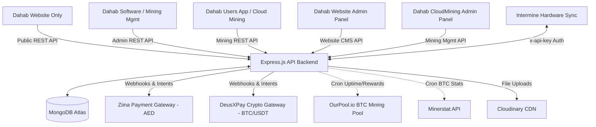

# DAHAB MINERS SYSTEM DOCUMENTATION & WORKFLOWS GUIDE

This document serves as the definitive architecture reference and workflow manual for developers working on the Dahab Miners software ecosystem. It covers the high-level system design, repository structures, environment variables, core business logic, database schemas, cron job integrations, and third-party APIs.

---

## 1. System Overview & Architecture

The Dahab Miners system consists of a centralized **Express/Node.js API Backend** that connects to a **MongoDB Database** and services **5 Vite/React Frontend Applications** plus an external **Intermine hardware sync system**. 

### 1.1 Architecture Diagram



### 1.2 Repositories & Roles

1. **Dahab Backend (`dahab-miners` / `dahab full website` / `Dahab-Backend-Next-Phase`)**
   - Core API server for the entire ecosystem. Handles database transactions, security, role-based authorization, automated cron jobs, email delivery, file uploads, and external webhooks.
2. **Dahab Website Only (`Dahab Website Only`)**
   - The public facing marketing website. Presents hosting packages (Ethiopia and Abu Dhabi facilities), physical miner sales, repair request pages, blogs, and events.
3. **Dahab Software (`Dahab Software`)**
   - Internal administration and logistics software. Used by physical facility managers to register hardware, track repairs, issue warranties, map warehouse inventories, log offline history, and manage clients.
4. **Dahab Users App (`Dahab-Users-App`)**
   - Client portal for cloud mining services. Users register, enable Two-Factor Authentication (2FA), purchase hash power packages, configure payout options, top up wallets, and request BTC withdrawals.
5. **Dahab-Website-Admin-Panel (`Dahab-Website-Admin-Panel`)**
   - CMS portal for marketing teams. Used to write and publish blogs, create community events, edit physical miners listing, and view web dashboard metrics.
6. **Dahab-CloudMining-App Admin Panel (`Dahab-CloudMining-App Admin Panel`)**
   - Cloud mining operational admin. Manages registered mining users, tracks owned miners, processes promotional vouchers, validates BTC withdrawals, and updates pool performance metrics.

---

## 2. Global Configuration & Setup

### 2.1 Environment Variables (Backend `.env`)
A copy of `.env` must be placed in the backend root directory containing:

```ini
# Database Config
MONGODB_URI=mongodb+srv://...           # MongoDB Production connection string
MONGODB_URI_DEV=mongodb+srv://...       # MongoDB Development connection string
NODE_ENV=development                    # Environment (development/production)
PORT=4000                               # API port (default: 4000)

# Encryption & Session
JWT_SECRET=your_jwt_secret_key          # Secret key for signing authorization tokens

# Email Config (Nodemailer)
NODEMAILER_EMAIL=support@dahabminers.ae  # Sender email address
NODEMAILER_PASS=your_email_app_password # Email provider application password

# Media Delivery (Cloudinary)
CLOUDINARY_CLOUD_NAME=...
CLOUDINARY_API_KEY=...
CLOUDINARY_API_SECRET=...

# Payment Gateway: Ziina (AED Fiat)
ZIINA_ACCESS_TOKEN=your_ziina_token     # Token for creating AED payment intents
ZIINA_WEBHOOK_SECRET=your_webhook_secret # Secret key for validating incoming Ziina signatures
FRONTEND_SUCCESS_URL=https://...        # Redirect target for successful miner purchase
FRONTEND_SUCCESS_URL_WALLET=https://... # Redirect target for successful wallet top-up
FRONTEND_FAILURE_URL=https://...        # Redirect target for failed checkouts
FRONTEND_CANCEL_URL=https://...         # Redirect target for canceled checkouts

# Payment Gateway: DeusXPay (Crypto Payments & Payouts)
DEUSX_PROFILE_UUID=...                  # Merchant profile ID for DeusXPay
DEUSX_WEBHOOK_TOKEN=...                 # Signature validator token
DEUSX_API_KEY2=...                      # Authorization API Key
DEUSX_API_SECRET2=...                   # Authorization Secret key

# External Pool Stats
OUR_POOL_WALLET=bc1q...                 # Public BTC wallet address connected to OurPool
INTERMINE_ALLOW_API_KEY=...             # API Key expected from Intermine system (in header x-api-key)
INTERMINE_API_KEY=...                   # API key used for external system actions
MINERSTAT_API_KEY=ms_...                # API key for BTC coin stats fetching

# Blog Content
BLOGSEO_API_KEY=...                     # Authentication key for SEO blog posting
```

### 2.2 Local Developer Setup
1. **Prerequisites**: Ensure Node.js (v18+) is installed.
2. **Backend Setup**:
   ```bash
   cd "d:\dahab full website"
   npm install
   # Make sure .env is populated
   npm start # Launches Nodemon dev server on http://localhost:4000
   ```
3. **Frontend Apps Setup**:
   Each React Vite app follows standard NPM setups. Navigate to any of the 5 folders and execute:
   ```bash
   npm install
   npm run dev # Launches dev server (typically on http://localhost:5173, http://localhost:5174, etc.)
   ```

---

## 3. Core Security & Middleware Architecture

Role-based access control (RBAC) is implemented via tokens stored in the `Authorization` header (`Bearer <token>`) or client-side `token` cookie. The backend `middleware/authMiddleware.js` provides several routing filters:

- **`authenticateUser`**: Parses and validates the JWT. Extracts `{ userId, username, role }` and assigns them to the request (`req.user`). If the token is missing or invalid, throws an `UnauthenticatedError`.
- **`isAdmin`**: Permits access only if the parsed role is `"superAdmin"`, `"admin"`, or `"repairAdmin"`.
- **`isSuperAdmin`**: Permits access only to `"superAdmin"`.
- **`isEditor`**: Restricted filter mapping to the `"admin"` role for CMS tasks.
- **`isRepairAdmin`**: Restricts access only to the `"repairAdmin"` role.
- **`isIntermine`**: Checks that the request header `x-api-key` matches the configured `process.env.INTERMINE_ALLOW_API_KEY`. Used exclusively to secure Intermine hardware synchronization.

---

## 4. Dahab Website Only

The primary marketing website provides public outreach, information, and a sales channel for physical hardware.

### 4.1 Tech Stack & Dependencies
- **Core**: React 18 / Vite 5 / Tailwind CSS 3 / Redux Toolkit / React Router 6.
- **Dependencies**: React Query (fetching), Framer Motion (animations), Recharts (price charts), Slick Carousel (sliders), MUI Material.

### 4.2 Key Features & Backend Connection

#### 4.2.1 Product Catalog & Order Intent
- **Purpose**: Users view physical mining hardware models available for purchase.
- **Frontend Path**: `BuyMiners` page.
- **Backend Endpoints & Logic**:
  - `GET /api/users/product`: Retrieves all hardware listings in stock. The controller `userProductController.js` queries the `ProductModel` collection filtering out test items.
  - **Expected Request**: Public query. Returns array of product details (name, image, power consumption, algorithm, price, stock quantity).

#### 4.2.2 Articles & Events
- **Purpose**: Reads published announcements, event schedules, and news blogs.
- **Frontend Path**: `blogs` and `eventsPage`.
- **Backend Endpoints & Logic**:
  - `GET /api/users/blogs`: Fetches blogs from the `BlogModel` schema that have their status set to public.
  - `GET /api/events`: Fetches upcoming company events and mining announcements from the `Events` schema.

#### 4.2.3 Contact and Repair Request
- **Purpose**: Allows external clients to submit a repair inquiry or message.
- **Frontend Path**: `MinerRepair` and contact forms.
- **Backend Endpoints & Logic**:
  - `POST /api/extra/contact`: Validates input parameters (email, name, message). Sends an automated notification email via `nodemailer` to backend support and stores the log under `DahabMessage` schema.

---

## 5. Dahab Software (Internal Operations)

This application serves as the primary system of record for real-world operations in the physical mining facilities (e.g., UAE, Ethiopia).

### 5.1 Tech Stack & Dependencies
- **Core**: React 19 / Vite 7 / Tailwind CSS 4 / MUI Material 7 / React Router 7.
- **Dependencies**: Axios, Day.js (date manipulation), Redux, TanStack React Query.

### 5.2 Key Features & Backend Connection

#### 5.2.1 Add & Sync Miner Data
- **Purpose**: Register a physical mining machine deployed to the farm.
- **Frontend Path**: `Inventory` / `overview` dashboard.
- **Backend Endpoint**: `POST /api/intermine/addMiner` (and `PATCH /api/intermine/editMiner`).
- **Authorization**: API Key validation via `isIntermine`.
- **Backend Body Payload**:
  ```json
  {
    "client": "string",
    "model": "A1246",          // Must match a registered MinerModel code
    "serialNumber": "SN12345", // Unique identifier
    "mac": "00:1a:2b:...",
    "worker": "worker_name",
    "status": "online",
    "location": "facility_code", // References facility code in MiningFarm
    "poolAddress": "stratum+tcp://...",
    "warrantyStart": "ISO Date",
    "warrantyEnd": "ISO Date"
  }
  ```
- **Backend Execution Logic**:
  1. Opens a Mongoose Database Session Transaction.
  2. Queries `MinerModel` by `model` code and `Client` by the client's name pattern.
  3. If a document under `Data` (the miner records collection) already exists with the `serialNumber`, it follows the edit workflow. Otherwise, it instantiates a new `Data` record.
  4. If `location` (facility code) is supplied, it verifies capacity in `MiningFarm`:
     - Checks if `farm.occupiedSlots >= farm.totalSlots`. If so, aborts transaction.
     - Increments `farm.occupiedSlots` by 1, adds miner power to `farm.current` wattage tracking, and pushes miner `_id` into `farm.miners` array.
  5. If `warrantyStart` and `warrantyEnd` are supplied, creates a `Warranty` record pointing to the client and the miner, linking it to the miner's `relatedWarranty`.
  6. Saves the models, creates an audit `Notification` log, commits transaction, and returns a `201 Created` status.

#### 5.2.2 Reporting Hardware Issues
- **Purpose**: Facility operators log a repair issue when a machine goes offline or drops hash rate.
- **Frontend Path**: `Issues` dashboard.
- **Backend Endpoint**: `PATCH /api/intermine/report-issue`.
- **Authorization**: API Key validation via `isIntermine`.
- **Backend Body Payload**:
  ```json
  {
    "model": "A1246",
    "serialNumber": "SN12345",
    "issue": "Power supply failure",
    "description": "High temperature cut-off",
    "issueId": "EXT-9988", // External tracking ID
    "type": "repair",
    "status": "offline"
  }
  ```
- **Backend Execution Logic**:
  1. Starts a Mongoose transaction.
  2. Finds the miner in `Data` by `serialNumber`.
  3. Checks if `miner.currentIssue` is active. If so, rejects with `400 Bad Request`.
  4. Instantiates a `DahabIssue` record: type `"repair"`, status `"Pending"`, owner `"Intermine"`, and external `intermineId`.
  5. Instantiates an initial chat `Message` inside the issue log.
  6. If input `status` is `"offline"`, updates `miner.status = "offline"`, sets `miner.offlineReason = "issue"`, and appends a record to the miner's `offlineHistory`.
  7. Sets `miner.currentIssue = newIssue._id`, pushes the ID to `miner.issueHistory`, and commits transaction.

#### 5.2.3 Issue Resolution Workflow
- **Purpose**: Closes a ticket when a physical repair is completed, bringing the miner online.
- **Frontend Path**: `repair` control module.
- **Backend Endpoint**: `PATCH /api/intermine/update-status` (Admin panel calls `PATCH /api/admin/issue/update`).
- **Backend Body Payload**:
  ```json
  {
    "issueId": "EXT-9988",
    "status": "Resolved",
    "serialNumber": "SN12345",
    "type": "repair"
  }
  ```
- **Backend Execution Logic**:
  1. Starts a transaction.
  2. Verifies the issue in `DahabIssue` and matching miner serial.
  3. Updates `issue.status = "Resolved"` and sets `issue.resolvedOn = new Date()`.
  4. Retrieves the miner from `Data` and resets `miner.currentIssue = null`.
  5. Updates `miner.status = "online"` (clearing the offline flags). Saves models and commits transaction.

---

## 6. Software Section 3: Dahab Users App (Cloud Mining Portal)

This client-facing application is where retail customers manage their cloud mining contracts, top up their wallets, configure payout logic, and request withdrawals.

### 6.1 Tech Stack & Dependencies
- **Core**: React 19 / Vite 6 / Tailwind CSS 4 / MUI Material 7.
- **Dependencies**: Axios, React Query, `qrcode.react` (2FA rendering), `bitcoin-address-validation` (validates client withdrawal addresses).

### 6.2 Key Features & Backend Connection

#### 6.2.1 Two-Factor Authentication (2FA) Signup & Login
- **Purpose**: Secure customer accounts prior to wallet or withdrawal operations.
- **Frontend Path**: `TwoFactor` and `twoFactorLogin` pages.
- **Backend Endpoints & Logic**:
  - `POST /api/mining/auth/2fa/generate`: Uses the npm package `speakeasy` to generate a secret key:
    ```javascript
    const secret = speakeasy.generateSecret({ name: `Dahab Miners (${username})` });
    ```
    Saves `secret.base32` under `user.twoFactorSecret` (not yet enabled). Sends `secret.otpauth_url` back to the frontend to render as a QR code using `qrcode.react`.
  - `POST /api/mining/auth/2fa/verify`: Receives the 6-digit OTP code. Validates it via `speakeasy.totp.verify`. If correct, sets `user.is2FAEnabled = true`.
  - `POST /api/mining/auth/2fa/login`: Evaluates the user credential. If 2FA is active, blocks normal session generation until the client sends a verified OTP via `speakeasy.totp.verify`.

#### 6.2.2 Purchasing Hashpower Packages & Wallet Top-up (Ziina Gateway - AED Fiat)
- **Purpose**: Checkout portal for buying miner hardware hashpower or adding money to the wallet.
- **Frontend Path**: `buyminers` and `wallet` recharge forms.
- **Backend Endpoint**: `POST /api/mining/payment/create-intent`.
- **Backend Body Payload**:
  ```json
  {
    "amount": 5000,               // Base cost in AED
    "message": "miner purchase",  // Or "wallet Topup"
    "items": "[{\"itemId\": \"...\", \"qty\": 1}]", // Stringified JSON items
    "voucherCode": "PROMO10"      // Optional coupon
  }
  ```
- **Backend Logic Flow**:
  1. Resolves `MiningUser` details.
  2. If `voucherCode` is supplied:
     - Verifies its presence in `MiningVoucher` or `user.referralVouchers`.
     - Validates expiration (`voucher.validity > now`) and minimum spending requirement.
     - Deducts the percentage discount: `discountValue = (amount * voucher.discount) / 100`.
     - Updates `finalAmount = amount - discountValue`.
  3. Formulates a payload for the external **Ziina API**:
     - Pushes `amount: Number(finalAmount * 100)` (Ziina expects fils/cents), currency `AED`, and callbacks (`FRONTEND_SUCCESS_URL` or `FRONTEND_SUCCESS_URL_WALLET` depending on intent).
     - Sends `POST https://api-v2.ziina.com/api/payment_intent` authenticated with `ZIINA_ACCESS_TOKEN`.
  4. Instantiates a tracking record in `MiningPayment` (storing `ziinaId`, `userId`, `items`, and coupon metrics) and returns the Ziina checkout URL to the customer.

#### 6.2.3 Ziina Webhook Handling
- **Backend Endpoint**: `POST /api/mining/payment/webhooks/ziina` (Webhook receiver).
- **Backend Security Check**: Verifies the signature `X-Hmac-Signature` using SHA-256 HMAC hashed with `process.env.ZIINA_WEBHOOK_SECRET`.
- **Business Logic on Completed (`payment_intent.status.updated`)**:
  - Updates payment record status to `"completed"`.
  - If `message === "miner purchase"` and not processed:
    - Calls `assignMinerToUser(userId, items)`:
      - Calculates prepayment for hosting:
        - If `isBulkHosting` is true: prepays 3 years of daily hosting fees: `qty * power * 24 * hostingFeePerKw * 3.67 * 365 * 3`.
        - If `isBulkHosting` is false: prepays 30 days: `qty * power * 24 * hostingFeePerKw * 3.67 * 30`.
      - Credits this amount to user's `walletBalance` and inserts a `WalletTransaction` (labeled as `"Miner Purchase Hosting Fee Prepayment"`).
      - Decrements product inventory `stock`, increments `sold`, creates an `OwnedMiner` record, and adds it to the user's `ownedMiners`.
  - If `message === "wallet Topup"` and not processed:
    - Calls `updateUserWallet(userId, amount)` which adds AED directly to `user.walletBalance`.
  - Marks payment document as `processed = true`.

#### 6.2.4 Purchasing Hashpower Packages & Wallet Top-up (DeusXPay Gateway - Crypto)
- **Purpose**: Checkout portal using BTC, USDT, or ETH.
- **Frontend Path**: `buyminers` / `wallet` checkout.
- **Backend Endpoint**: `POST /api/mining/payment/create-crypto-intent`.
- **Backend Body Payload**:
  ```json
  {
    "amount": 5000, // Total cost in AED
    "message": "miner purchase", // Or "wallet Topup"
    "items": "[...]",
    "crypto": "BTC", // Target crypto coin (USDT, BTC, etc.)
    "voucherCode": "..."
  }
  ```
- **Backend Logic Flow**:
  1. Applies voucher validation & calculates final AED amount.
  2. Contacts **DeusXPay API** by calling `POST payments/` with:
     ```json
     {
       "requested_currency": "AED",
       "requested_amount": "finalAEDAmount",
       "payment_currency": "BTC",
       "profile_uuid": "DEUSX_PROFILE_UUID",
       "passthrough": "{\"orderId\":\"UUID\", \"note\":\"miner purchase\"}",
       "notes": "miner purchase"
     }
     ```
  3. Instantiates `MiningCryptoPayment` document with generated address details and returns the payment metadata to the client.

#### 6.2.5 DeusXPay Webhook Handling
- **Backend Endpoint**: `POST /api/mining/payment/webhooks/deusx`.
- **Security Check**: Verifies signature utilizing `callback_id` and `signature` keys.
- **Logic on Payment Complete (`payment_complete`)**:
  - Updates `MiningCryptoPayment` status.
  - If not processed:
    - For `"miner purchase"` notes, triggers `assignMinerToUser` (updating stock, creating `OwnedMiner` documents, and crediting the wallet with the prepayment hosting balance).
    - For `"wallet Topup"` notes, triggers `updateUserWallet` (adding AED to `user.walletBalance`).
    - Sets `payment.processed = true`.

#### 6.2.6 Wallet Withdrawals (BTC Payout Request)
- **Purpose**: Users transfer earned BTC to their external private wallets.
- **Frontend Path**: `payout` requests panel.
- **Backend Endpoint**: `POST /api/mining/payout/create-withdrawal-intent`.
- **Backend Request Payload**:
  ```json
  {
    "amount": 0.015,                      // Amount in BTC
    "address": "bc1qyourbtcaddresshere..." // Customer external address
  }
  ```
- **Backend Security & Business Validations**:
  1. Validates BTC address using `bitcoin-address-validation`.
  2. Rejects if user has existing pending payouts: `status: { $nin: ["Complete", "Failed", "Cancelled", "Rejected"] }`.
  3. Rejects if user wallet balance is negative: `user.walletBalance < 0` (user owes hosting fees).
  4. Calculates total debit: `amount + 0.00033 BTC` (representing network transaction fee). Rejects if `user.currentBalance < totalAmount`.
  5. Contacts **DeusXPay Withdrawals API** calling `POST withdrawals/`:
     ```json
     {
       "fiat_currency": "AED",
       "crypto_amount_net": 0.015,
       "profile_id": "DEUSX_PROFILE_UUID",
       "address": "bc1qyourbtcaddresshere...",
       "currency": "BTC",
       "network": "BTC",
       "notes": "Withdrawal"
     }
     ```
  6. Creates a `MiningPayout` transaction tracking record with status `"Pending"`, inserts it into `user.allPayouts`, and returns intent details.
- **Deduction Processing via Webhook (`withdrawal_complete`)**:
  - When DeusXPay processes the blockchain withdrawal, its webhook is caught by the backend.
  - Updates `withdrawal.status = "Completed"`.
  - Deducts the requested payout amount from the user's balance:
    ```javascript
    user.currentBalance = user.currentBalance - withdrawal.amount;
    user.amountWithdrawed = user.amountWithdrawed + withdrawal.amount;
    withdrawal.isUpdated = true;
    ```
  - Saves the updated user and withdrawal documents.

---

## 7. Backend Cron Automations & Core Business Math

The backend operates several scheduled tasks configured via `node-cron` in `index.js`, using the **UAE (Asia/Dubai) timezone**.

### 7.1 Daily S19KPro Revenue Distribution Cron
- **Schedule**: `15 0 * * *` (Daily at 12:15 AM UAE time).
- **Automation File**: `cronJobs/S19KRevenueAutomation.js`.
- **Mathematical Formula**:
  1. Fetches current daily base satoshi rate (`satPerDay`) from `MiningSats` collection.
  2. Queries all users who own miners and calculates the aggregate hash rate of active `S19KPro` units:
     $$\text{SumHashRate} = \sum (\text{product.hashRate} \times \text{owned.qty})$$
     *(skipping expired contracts where `validity < now`)*.
  3. Computes the adjusted reward distributed per TeraHash (accounting for a 10% operational fee):
     $$\text{RevenuePerTH} = \frac{\text{satPerDay} \times \text{SumHashRate} \times 0.9}{\text{SumHashRate}} = \text{satPerDay} \times 0.9 \text{ satoshis/TH}$$
  4. For each active user:
     $$\text{UserDailyRevenue} = \sum (\text{userProduct.hashRate} \times \text{userOwned.qty}) \times \text{RevenuePerTH}$$
     - Increments `user.currentBalance` (BTC/Sats) and `user.minedRevenue` by `UserDailyRevenue`.
     - Appends an entry to the user's `allMinedRewards` tracking array and inserts a new `MinedReward` log document.
  5. Inserts a global `MiningRevenue` log tracking the aggregate payout details.

### 7.2 Daily A1246 Revenue & Uptime Cron
- **Schedule**: `50 1 * * *` (Daily at 1:50 AM UAE time).
- **Automation File**: `cronJobs/A124RevenueAutomation.js`.
- **Revenue Integration Logic**:
  1. Calls `OurPool.io` API to retrieve wallet withdrawal transactions:
     `GET https://ourpool.io/api/v1/anonymous/${process.env.OUR_POOL_WALLET}/transactions`
  2. Filters out transactions with type `"TX_TYPE_SCHEDULED_USER_MINING_REWARDS_WITHDRAWAL"` created in the previous 24 hours (ending at 3:30 AM UAE time).
  3. Calculates the sum of values: $\text{TotalBTCRevenue}$. If 0, it falls back to parsing differences in pool reward stats:
     $$\text{FallBackRevenue} = \text{PoolPaid}_{\text{today}} - \text{PoolPaid}_{\text{yesterday}}$$
  4. Calls `OurPool.io` workers API to query performance uptime:
     `GET https://ourpool.io/api/v1/anonymous/${process.env.OUR_POOL_WALLET}/btc/miner/workers`
  5. Calculates cumulative hashrate and divides it by the baseline farm scale of 90,000 TH to resolve uptime percentage:
     $$\text{DeliveredHashRate (TH)} = \frac{\sum \text{worker.hashrate24h}}{10^{12}}$$
     $$\text{UptimeRatio} = \frac{\text{DeliveredHashRate (TH)}}{90,000 \text{ TH}}$$
  6. Evaluates individual rewards:
     $$\text{RevenuePerTH} = \frac{\text{TotalBTCRevenue}}{90,000 \text{ TH}}$$
     $$\text{UserRevenue} = (\text{product.hashRate} \times \text{owned.qty}) \times \text{RevenuePerTH}$$
     Adds this amount to user's balance and records `MinedReward` logs.

### 7.3 Daily Hosting Fee Deduction Cron
- **Schedule**: `58 0 * * *` (Daily at 12:58 AM UAE time).
- **Automation File**: `cronJobs/walletDeductions.js` (Also triggered inside A1246 revenue run).
- **Mathematical Formula**:
  $$\text{DailyHostingFee (AED)} = \text{qty} \times \text{power (kW)} \times 24 \text{ hours} \times \text{hostingFeePerKw (USD)} \times 3.67 \text{ (AED conversion multiplier)}$$
  *(Note: A1246 hosting fee is prorated by the calculated uptime percentage if uptime falls below 95%:* $\text{DailyHostingFee} = \text{DailyHostingFee} \times \text{UptimeRatio}$*).*
- **Payout Mode Switching Logic**:
  For each user owning active miners:
  - **Case 1: Payout Mode is `"hold"`**
    Deducts the calculated $\text{DailyHostingFee}$ directly from `user.walletBalance` (AED balance). Creates a `WalletTransaction` (type `"debited"`).
  - **Case 2: Payout Mode is `"profit"`**
    Converts the AED hosting fee into BTC using the cached daily exchange rate:
    $$\text{HostingFeeInBTC} = \frac{\text{DailyHostingFee}}{\text{BTCPriceUSD} \times 3.67}$$
    1. If `HostingFeeInBTC` is less than the user's latest mined reward:
       Deducts `HostingFeeInBTC` from `user.currentBalance` (BTC). Creates a `ProfitModeTransaction` log.
    2. If `HostingFeeInBTC` exceeds or equals the user's latest mined reward:
       Automatically switches the user's payout settings: `user.payoutMode = "hold"`.
       Deducts the hosting fee in AED from `user.walletBalance` instead (which can result in a negative wallet balance). Creates a `WalletTransaction` with a warning message: `"Payout mode auto-switched to hold mode"`.

### 7.4 Negative Wallet Balance Settlement
- **Purpose**: Users top up their wallet or convert accrued BTC rewards to settle unpaid hosting fees.
- **Frontend Path**: `wallet` control dashboard.
- **Backend Endpoint**: `POST /api/mining/users/settle-negative-wallet`.
- **Backend Logic Flow**:
  1. Validates that `user.walletBalance < 0`. Let $\text{RequiredAED} = |\text{user.walletBalance}|$.
  2. Queries Minerstat API `https://api.minerstat.com/v2/coins?list=BTC` to get the latest BTC price and saves it under `BitCoinData`.
  3. Calculates equivalent BTC required:
     $$\text{RequiredBTC} = \frac{\text{RequiredAED}}{\text{BTCPriceAED}}$$
  4. If `user.currentBalance >= RequiredBTC`:
     - Subtracts `RequiredBTC` from `user.currentBalance`.
     - Resets `user.walletBalance = 0`.
     - Logs a credited `WalletTransaction` and a `ProfitModeTransaction`.
  5. If `user.currentBalance < RequiredBTC`:
     - Recovers a partial amount: $\text{RecoveredAED} = \text{user.currentBalance} \times \text{BTCPriceAED}$.
     - Resets `user.currentBalance = 0`.
     - Adds $\text{RecoveredAED}$ to `user.walletBalance` (leaving the balance partially negative).
     - Logs a credited `WalletTransaction` and a `ProfitModeTransaction` detailing the conversion.

---

## 8. Developer Reference & Best Practices

1. **Transaction Integrity**: Always use Mongoose session transactions (`startSession()` -> `startTransaction()`) when updating user balances, processing inventory checkouts, or syncing Intermine records.
2. **Uptime and Safety Controls**: The daily hosting fee deductions can result in negative wallet balances. Avoid manual edits to the `payoutMode` switch; instead, let the cron job evaluate balances and handle switches to `"hold"` mode automatically.
3. **API Key Isolation**: Never hardcode client credentials. Use `process.env.INTERMINE_ALLOW_API_KEY` for Intermine sync endpoints, and secure admin routes with the role middleware chains: `authenticateUser, isAdmin` or `authenticateUser, isSuperAdmin`.
